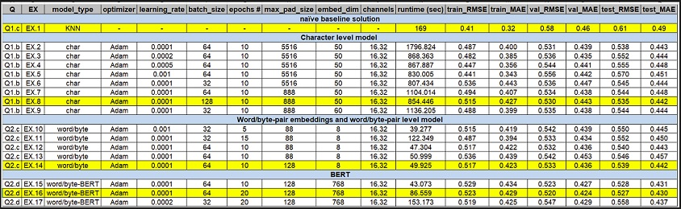

# search-relevance-prediction-siamese-homedepot

Based on the Kaggle link: https://www.kaggle.com/c/home-depot-product-search-relevance/data

## Introduction
Leveraging the power of deep learning to enhance e-commerce search functionality, this report outlines our approach to the Home Depot product search relevance prediction challenge. 
By employing Siamese Networks with Convolutional Neural Networks (CNNs), our method focuses on accurately pairing customer search terms with the most relevant product listings. 
This model aims to predict relevance scores by deeply analyzing the nuances of textual data from search terms and product descriptions.

## Main steps performed
- Exploratory Data Analysis
- Naive benchmark using KNN
- Character level model
- Word level model
- Sentence level model using BERT embeddings

## Results
 
